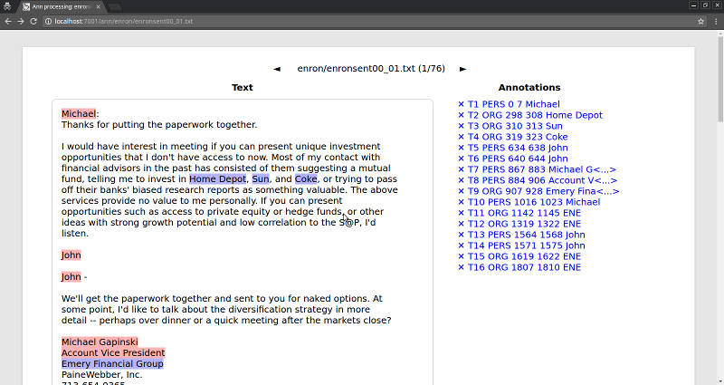
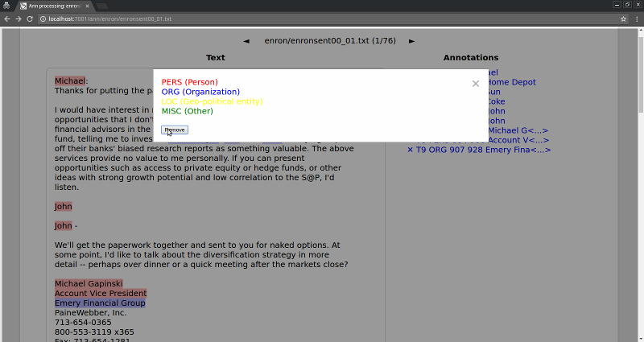

# ANN -- a simple annotation tool

## Usage

The normal ANN run sequence may be found in `run.lisp`.
It may be invoked either from the REPL or shell: e.g. `sbcl --load run.lisp`.

The documents for annotation should be put into the `data/` dir. Currently, a small portion of the Enron corpus is

To select a particular annotation scheme the root folder of the texts to annotate should have a file `.ann.yaml` (similar in format to the [default one](data/enron/.ann.yaml)).

New annotation schemes may be defined in `schemas/` dir. The default one is for NER annotation.

The annotation process is intuitive: just select the spans to annotate and choose the appropriate class. Incorrect annotations may be removed. All changes are persisted to disk in an `.ann` file alongside the text file at once.

## License

The license of ANN is Apache 2.0.

(c) 2016-2017, Vsevolod Dyomkin <vseloved@gmail.com>

